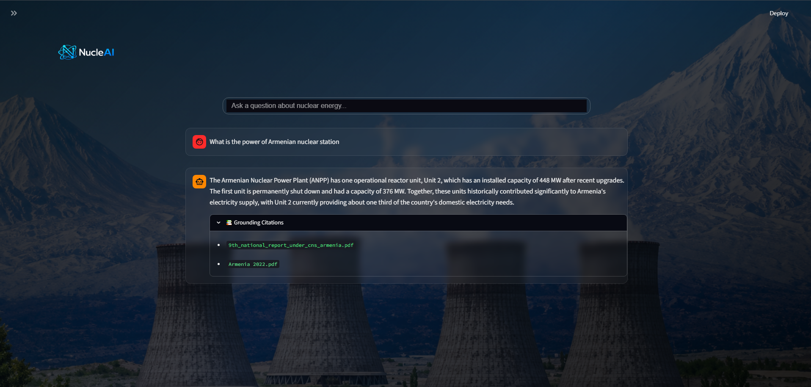
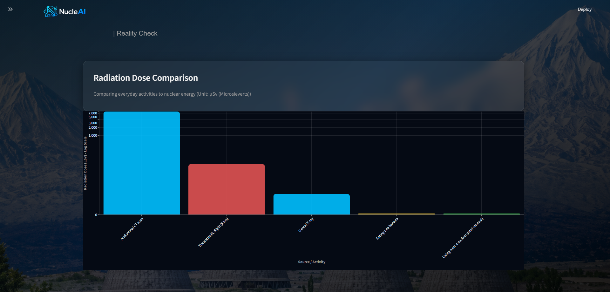
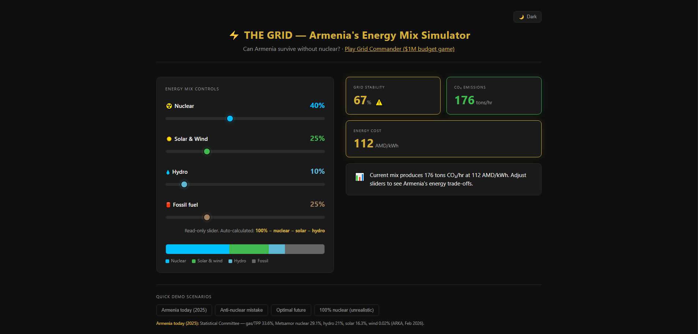
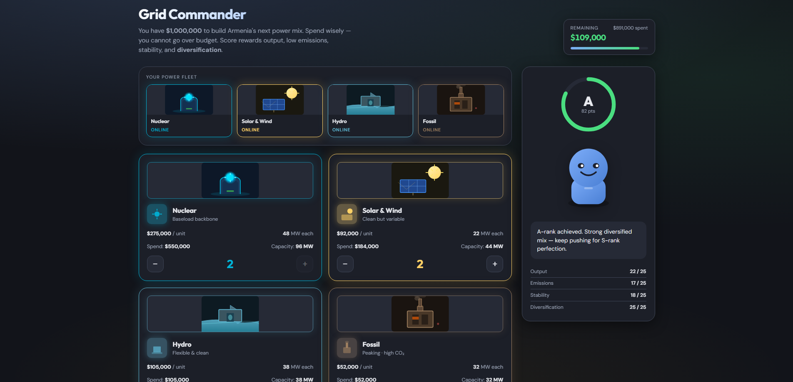
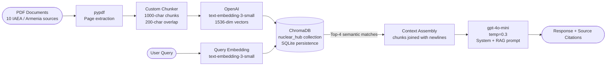
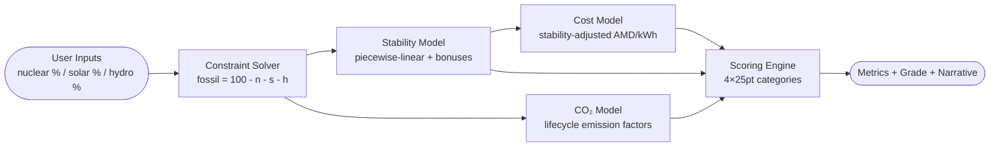

<div align="center">


# NucleAI

**A grounded AI platform for nuclear energy literacy, powered by document retrieval and deterministic grid simulation.**

NucleAI combines a Retrieval-Augmented Generation chatbot grounded in IAEA source documents with an interactive energy-grid simulation engine — enabling evidence-based exploration of nuclear energy, radiation safety, and Armenia's energy future.

---

[](https://fastapi.tiangolo.com/)
[](https://streamlit.io/)
[](https://www.trychroma.com/)
[](https://openai.com/)
[](LICENSE)

</div>

---

## Why NucleAI Exists

Public discourse around nuclear energy is shaped more by fear than by evidence. In Armenia — where Metsamor Nuclear Power Plant supplies approximately 29% of national electricity — the gap between public perception and documented scientific consensus carries concrete policy consequences. Energy decisions made without factual grounding affect grid stability, energy prices, and long-term carbon commitments.

Existing tools either explain nuclear energy through generic LLM responses (unverifiable, prone to hallucination) or through static infographics (non-interactive, quickly outdated). Neither approach gives a curious reader the ability to interrogate evidence, trace claims to sources, or understand the systemic tradeoffs of different energy strategies.

NucleAI was built to close that gap: a platform where every AI response is traceable to a source document, and where energy-mix decisions can be modeled with explicit, inspectable mathematics.

---

## Meet NucleAI

The platform is composed of four interconnected modules, each addressing a different aspect of nuclear literacy.

### AI Mythbuster



The Mythbuster is a RAG-powered chatbot grounded exclusively in a curated knowledge base of IAEA publications, Armenian energy reports, and radiation safety documentation. When a user submits a question, the system retrieves the four most semantically relevant passages from that knowledge base, assembles them as context, and instructs the language model to generate a response bounded by what those passages contain.

Every response surfaces its source documents as citations. The model is instructed to explicitly acknowledge when a question falls outside available context, rather than generating plausible-sounding but unverifiable content.

This is not a general-purpose chatbot. It is a domain-constrained information retrieval system with a language model interface.

---

### Reality Check



The Reality Check dashboard renders radiation dose data as interactive Altair bar charts on a logarithmic scale, placing nuclear-industry exposure levels alongside dental X-rays, transatlantic flights, and abdominal CT scans. The visualizations are sourced from IAEA-documented dose values, not estimates.

The purpose is radiation literacy: enabling a reader to form calibrated intuitions about dose magnitudes rather than relying on abstract comparisons. Each data point includes a contextual annotation explaining its real-world significance.

---

### Energy Grid Simulator



The Grid Simulator is a browser-native, zero-dependency simulation tool that allows real-time exploration of Armenia's energy mix. Three independent sliders control the percentage contribution of nuclear, solar/wind, and hydro generation; fossil fuel share is computed automatically as the remainder.

Each configuration produces deterministic outputs for grid stability, CO₂ emissions (tons/hour), and energy cost (AMD/kWh), calculated via an explicit mathematical model rather than a trained predictor. The simulation acknowledges real grid dynamics: intermittency penalties for high solar penetration, baseload stability contributions from nuclear, and cost multipliers under grid stress conditions.

---

### Grid Commander



Grid Commander is a single-screen strategy game in which the player allocates a fixed $1,000,000 budget across four energy source types (nuclear, solar/wind, hydro, fossil). Each source has a defined unit cost and installed capacity in MW. The resulting generation mix feeds the same deterministic grid engine as the simulator.

Performance is scored across four equally weighted 25-point categories — output, emissions, grid stability, and source diversification — with explicit penalty deductions for crisis-level instability or extreme emissions. A persistent AI advisor character provides contextual feedback based on the player's current grid state.

---

## What Makes NucleAI Different

**Retrieval before generation.** The chatbot component does not ask a language model what it knows about nuclear energy. It retrieves specific passages from a defined document set and instructs the model to stay within that context. The difference is architectural: grounded retrieval is verifiable; free-form generation is not.

**Simulation over approximation.** The grid engine is fully deterministic. Every output — stability percentage, CO₂ tons per hour, AMD/kWh cost — is computed from explicit formulas with documented coefficients derived from IAEA lifecycle data and Armenia's grid statistics. There are no black-box predictions. The model can be read, audited, and corrected.

**Interpretability by design.** Source citations are returned with every chatbot response. Simulation formulas are open in `NuclearGame/react/gridEngine.js` and `managementEngine.js`. The separation between the knowledge engine and the simulation engine is explicit and inspectable.

**Domain constraints as a feature.** The system is deliberately scoped to nuclear energy, radiation safety, and Armenian energy context. Narrowing the domain is not a limitation — it is what makes the retrieval pipeline accurate and the simulation model calibrated.

**No training. No fine-tuning.** NucleAI uses hosted OpenAI models exclusively at inference time. No custom weights, no training loops, no gradient computation. The intellectual investment is in the retrieval architecture, the simulation mathematics, and the knowledge base curation.

---

## Under The Hood

### Document Retrieval Architecture



### Simulation Architecture



---

## The Knowledge Engine

### Document Corpus

The knowledge base consists of 10 PDF documents (totaling approximately 8.6 MB) covering IAEA safety standards, Armenian nuclear power plant inspection reports, radiation risk communication guidelines, and national energy statistics.

| Document | Source | Coverage |
|----------|--------|----------|
| `Armenia 2022.pdf` | Armenian government | National energy statistics 2022 |
| `9th_national_report_under_cns_armenia.pdf` | IAEA | Convention on Nuclear Safety report |
| `irrs_armenia_follow-up.pdf` | IAEA | Integrated Regulatory Review Service |
| `PUB1949_web.pdf` | IAEA | Nuclear safety publication |
| `PUB2054_web.pdf` | IAEA | Nuclear safety publication |
| `gc69-statement-armenia.pdf` | IAEA | General Conference statement |
| `rasa-cosmic.pdf` | IAEA | Cosmic radiation assessment |
| `communicating-radiation-risks-in-paediatric-imaging-chapter-1.pdf` | IAEA | Radiation communication |
| `39_armenian_salto_fu_executive_summary.pdf` | IAEA | Safety assessment follow-up |
| `Armenia.pdf` | Government | Country nuclear overview |

### Chunking Strategy

The ingestion pipeline uses a custom pure-Python chunker (`ingest.py`) rather than a third-party text splitter. This decision was made to eliminate a transitive PyTorch dependency introduced by LangChain's text splitter on Windows — a concrete example of dependency management taking priority over convenience.

The chunker applies a three-level granularity cascade:

```
Paragraph boundaries (\n\n)
    → Line boundaries (\n)         [for oversized paragraphs]
        → Word boundaries (' ')    [for oversized lines]
```

| Parameter | Value | Rationale |
|-----------|-------|-----------|
| `chunk_size` | 1000 characters | Balances semantic completeness against embedding token limits |
| `chunk_overlap` | 200 characters | Preserves cross-boundary context without doubling storage |

Each chunk is assigned metadata: `source` (original filename) and `page` (1-indexed page number). Chunk IDs follow the format `{filename}_p{page}_c{chunk_index}`, enabling direct traceability from a retrieved passage back to its origin.

### Embedding and Retrieval

| Component | Implementation |
|-----------|---------------|
| Embedding model | `text-embedding-3-small` (OpenAI) — 1536-dimensional output |
| Vector store | ChromaDB `PersistentClient` with SQLite backend |
| Collection | `nuclear_hub` — single collection across all source documents |
| Batch insert size | 100 chunks per call (avoids API payload limits) |
| Retrieval | Top-4 cosine similarity results per query |

Embeddings are computed once during ingestion and persisted to `./chroma_db/`. The same `OpenAIEmbeddingFunction` instance is used at both ingestion time and query time, ensuring the embedding space is consistent.

### Context Assembly and Generation

Retrieved passages are joined with double newlines and inserted into `RAG_PROMPT_TEMPLATE`:

```
CONTEXT FROM KNOWLEDGE BASE:
{retrieved_passages}

QUESTION: {user_query}

Provide a clear, accurate answer. If the context contains specific statistics
or facts relevant to the question, use them. Keep the answer focused and helpful.
```

This prompt is submitted to `gpt-4o-mini` at `temperature=0.3` — a value selected to suppress speculative elaboration while preserving coherent natural language output. The system prompt (`SYSTEM_PROMPT`) establishes the persona "NuclearGuide" and explicitly prohibits the model from dismissing safety concerns, providing medical advice, or claiming zero-risk status for nuclear energy.

Source filenames from retrieved chunk metadata are deduplicated and returned alongside the generated answer as citations.

---

## The Simulation Engine

The grid simulation engine (`NuclearGame/react/gridEngine.js`, `managementEngine.js`) is a collection of explicit mathematical models. It contains no machine learning components. Every coefficient is documented and auditable.

### Grid Stability Model

Grid stability represents a composite index of reliable baseload coverage and intermittency tolerance, expressed as a percentage (0–100).

**Base formula:**
```
stability = 30 + (nuclear × 0.65) + (fossil × 0.30) + (hydro × 0.35)
```

**Conditional modifiers:**

| Condition | Effect | Physical Reasoning |
|-----------|--------|--------------------|
| `solar > 40%` | `stability -= (solar - 40) × 1.8` | High variable-generation penetration degrades frequency stability |
| `nuclear ≥ 30% AND solar > 40%` | `stability += nuclear × 0.25` | Nuclear baseload compensates for solar intermittency |
| Optimal mix* | `stability += 15` | Diversified mix with nuclear anchor and controlled fossil peaking |

*Optimal mix: nuclear ≥ 50%, 20% ≤ solar ≤ 45%, hydro ≥ 5%, 0% < fossil ≤ 15%

Output is clamped to [0, 100] and rounded to the nearest integer.

### CO₂ Emissions Model

Lifecycle emission factors are sourced from IAEA published data (grams CO₂-equivalent per kWh of generation):

| Source | Lifecycle Factor (g CO₂/kWh) |
|--------|------------------------------|
| Fossil (gas/TPP) | 650 |
| Solar & Wind | 48 |
| Hydropower | 24 |
| Nuclear | 12 |

**Formula** (output in metric tons per hour, using Armenia's approximate 970 MW grid capacity):

```
totalGCO₂perKwh = (fossil/100 × 650) + (solar/100 × 48) + (hydro/100 × 24) + (nuclear/100 × 12)

CO₂ (tons/hr) = round( totalGCO₂perKwh × 970 MW × 1000 kW/MW ÷ 1,000,000 g/ton )
```

### Energy Cost Model

Energy cost is expressed in Armenian Dram per kilowatt-hour (AMD/kWh):

```
base_cost = 75 - (solar × 0.15) - (hydro × 0.12) + (fossil × 0.30) + (nuclear × 0.05)
```

**Stability penalties** (applied sequentially):

| Condition | Adjustment | Rationale |
|-----------|-----------|-----------|
| `stability < 80` | `+= (80 - stability) × 2.5` | Instability premium — reserve capacity procurement |
| `stability < 50` | `×= 1.6` | Emergency cost multiplier — crisis grid pricing |

Output is floored at 40 AMD/kWh. This floor represents the minimum achievable cost in the model under ideal conditions.

### Grid Commander Scoring

The budget management game scores player configurations on a 100-point scale across four equally weighted categories.

**Budget parameters:**

| Source | Unit Cost | Capacity | Color Token |
|--------|-----------|----------|-------------|
| Nuclear | $275,000 | 48 MW | `#00b4d8` |
| Hydro | $105,000 | 38 MW | `#5eb8d4` |
| Solar & Wind | $92,000 | 22 MW | `#ffd166` |
| Fossil | $52,000 | 32 MW | `#a08060` |

**Scoring categories:**

| Category | Formula | Max Points |
|----------|---------|-----------|
| Output | `min(25, round(annualGWh / 1000 × 25))` | 25 |
| Emissions | `clamp(round(25 − CO₂ / 14), 0, 25)` | 25 |
| Stability | `clamp(round(stability / 100 × 25), 0, 25)` | 25 |
| Diversification | Piecewise (see below) | 25 |

Annual output GWh uses a stability-adjusted capacity factor:

```
annualGWh = totalMW × 0.52 × (0.7 + stability/100 × 0.3) × 8760 × 0.001
```

**Diversification scoring** rewards multi-source portfolio construction:

| Sub-criterion | 4 source types | 3 types | 2 types |
|--------------|---------------|---------|---------|
| Active sources | +10 | +7 | +3 |
| Sources with ≥8% share | +8 | +5 | +2 |

| Maximum single-source share | ≤50% | ≤60% | ≤70% |
|-----------------------------|------|------|------|
| Points | +7 | +5 | +2 |

Penalties apply for extreme concentration (maxShare ≥ 85%: −8 pts) or single-source grids (−10 pts).

**Score penalties and grade mapping:**

| Condition | Penalty |
|-----------|---------|
| `stability < 50%` | −12 points |
| `CO₂ > 500 tons/hr` | −8 points |

| Score | Grade |
|-------|-------|
| ≥ 90 | S |
| ≥ 80 | A |
| ≥ 65 | B |
| ≥ 50 | C |
| ≥ 35 | D |
| < 35 | F |

---

## Design Philosophy

**Grounded Before Generated**

Language models are capable of generating fluent, confident, and incorrect responses about nuclear energy. The architecture addresses this directly: responses are generated only within the boundaries of retrieved source documents. When the knowledge base does not contain relevant information, the system is instructed to say so explicitly rather than extrapolate. Grounding is not a convenience feature — it is the mechanism by which the system maintains scientific credibility.

**Interpretability Before Complexity**

Every computed output in the simulation engine is the result of an explicit, readable formula. There are no trained models making opaque predictions about grid stability or emissions. A developer can open `gridEngine.js`, read the stability formula, change a coefficient, and immediately understand the downstream effect. This transparency was an explicit design requirement, not an afterthought.

**Education Before Automation**

The platform is not designed to give users answers — it is designed to give users understanding. The chatbot shows source citations so readers can evaluate the evidence. The simulator requires manual slider adjustments so users build intuition about energy tradeoffs. The scoring system explains what each dimension measures. Every interaction is structured to leave the user more informed than they arrived.

**Transparency Before Abstraction**

The system prompt is readable in `main.py`. The chunking parameters are configurable in `ingest.py`. The simulation coefficients are commented in `gridEngine.js`. The knowledge base is a directory of real, downloadable PDF documents. NucleAI does not hide its mechanisms behind configuration layers or opaque services.

---

## Technology Decisions

| Technology | Role | Why it was chosen |
|------------|------|------------------|
| **FastAPI** | REST API backend | Provides automatic OpenAPI documentation, native Pydantic schema validation, and async support without ceremony. The `/docs` endpoint is immediately useful for frontend integration and debugging. |
| **ChromaDB** | Vector store | Runs as a persistent local database with no external server dependency. The SQLite backend is a single file, making the embedded knowledge base fully portable and Git-friendly for small corpora. |
| **OpenAI API** | Embeddings and generation | `text-embedding-3-small` offers strong retrieval quality at low cost per token. `gpt-4o-mini` provides coherent generation at `temperature=0.3` without fine-tuning overhead. Both are consumed as API calls — no local GPU required. |
| **Streamlit** | Frontend application | Enables a multi-page application with data visualization components without requiring a separate JavaScript frontend build pipeline. The `enableStaticServing` option serves the logo and background assets directly. |
| **Altair** | Data visualization | Declarative charting library with native Streamlit integration. The `mark_arc` and `mark_bar` encodings with logarithmic scale, symlog scale, and conditional color expressions produce publication-quality charts with compact specification. |
| **Vanilla JavaScript** | Simulation engine | The grid simulator and Grid Commander game have zero runtime dependencies. The simulation engine is a collection of pure functions that can be imported as an ES module, embedded directly in an HTML `<script>` tag, or integrated into a React component — without a bundler or build step. |

**A note on LangChain:** `langchain`, `langchain-openai`, and `langchain-community` appear in `requirements.txt` as legacy entries from the initial design phase. The production code imports none of these packages. The RAG pipeline is implemented directly against the ChromaDB Python client and the OpenAI Python SDK. This eliminates a transitive dependency that introduced a local PyTorch installation requirement on Windows — a concrete dependency management decision with measurable impact on developer setup time.

---

## Repository Anatomy

```
NucleAI/
│
├── main.py                   # FastAPI application — RAG pipeline and data endpoints
├── ingest.py                 # Offline ingestion script — PDF to ChromaDB
├── requirements.txt          # Python dependencies
├── run.bat                   # Windows process launcher (uvicorn + streamlit)
│
├── data/                     # Source document corpus (10 IAEA/Armenia PDFs)
│
├── chroma_db/                # Persisted vector store (auto-generated by ingest.py)
│   └── chroma.sqlite3        # SQLite backing store (~17 MB after ingestion)
│
├── assets/                   # Shared static assets (logo, background)
│
├── nucleai/                  # Streamlit frontend application
│   ├── app.py                # Entry point — sidebar navigation and page routing
│   ├── .streamlit/
│   │   └── config.toml       # Theme configuration (dark mode, primary color)
│   ├── styles/
│   │   └── global_css.py     # Injected CSS — glassmorphism, typography, animations
│   ├── utils/
│   │   └── ui_helpers.py     # Reusable UI components: glass_card, metric_badge
│   ├── static/               # Streamlit static file serving (logo, background)
│   └── pages/
│       ├── _1_Mythbuster.py      # RAG chatbot interface
│       ├── _2_Reality_Check.py   # Radiation dose visualization
│       ├── _3_Grid_Safety.py     # Armenia energy mix + safety + CO₂ charts
│       └── _4_Beyond_Energy.py   # Nuclear medicine, agriculture, space applications
│
└── NuclearGame/              # Standalone HTML/JS simulation suite
    ├── index.html            # The Grid — energy mix simulator (self-contained)
    ├── management.html       # Grid Commander — $1M budget strategy game
    ├── game.html             # Redirect shim to management.html
    ├── misc/
    │   └── index.html        # ES module variant of The Grid (imports gridEngine.js)
    └── react/
        ├── gridEngine.js          # Pure math and story engine (framework-agnostic)
        ├── gridEngine.browser.js  # Browser-compatible module variant
        ├── managementEngine.js    # Budget allocation and scoring engine
        ├── GridSimulator.jsx      # React component wrapping gridEngine.js
        ├── GridSimulator.css      # Scoped styles for React integration
        ├── index.js               # Barrel exports
        └── README.md              # React integration guide
```

The separation between `NuclearGame/index.html` (self-contained, inlined logic) and `NuclearGame/misc/index.html` (ES module import) is intentional: the self-contained version works without a web server; the module variant enables the React component to share a single canonical engine implementation.

---

## API Surface

The FastAPI backend exposes five endpoints. Full interactive documentation is available at `http://localhost:8000/docs` when the server is running.

| Method | Endpoint | Description |
|--------|----------|-------------|
| `GET` | `/` | Health check — service name and version |
| `GET` | `/api/health` | Detailed health — API key loaded, ChromaDB status, RAG pipeline active |
| `POST` | `/api/mythbuster` | Submit a query; returns generated answer and source citations |
| `GET` | `/api/radiation-data` | Returns curated radiation dose data points in μSv |
| `GET` | `/api/energy-safety` | Returns Armenia energy mix, safety records, and CO₂ lifecycle data |
| `GET` | `/api/beyond-energy` | Returns nuclear medicine, agriculture, and space application data |

**Example — Mythbuster request:**
```json
POST /api/mythbuster
{
  "query": "How does radiation from Metsamor compare to a dental X-ray?"
}
```

**Example — Mythbuster response:**
```json
{
  "answer": "According to IAEA safety standards, living within 80 km of a nuclear plant for an entire year results in approximately 0.09 μSv of exposure — significantly less than a single dental bitewing X-ray at 5 μSv...",
  "sources": ["irrs_armenia_follow-up.pdf", "Armenia 2022.pdf"]
}
```

---

## Getting Started

### Prerequisites

- Python 3.10 or later
- An OpenAI API key with access to `text-embedding-3-small` and `gpt-4o-mini`
- Git

### Installation

```bash
git clone https://github.com/VaheGdlyan/NucleAI.git
cd NucleAI

python -m venv venv

# Windows
venv\Scripts\activate

# macOS / Linux
source venv/bin/activate

pip install -r requirements.txt
```

### Environment Variables

Create a `.env` file in the project root:

```env
OPENAI_API_KEY=sk-...
```

The application will not start the RAG pipeline without this key. The health endpoint at `/api/health` reports the key status without exposing the key value.

### Build the Knowledge Base

This step runs once. It extracts text from all PDFs in `./data/`, chunks them, generates embeddings via the OpenAI API, and persists the vector store to `./chroma_db/`.

```bash
python ingest.py
```

Expected output:

```
Found 10 PDF files to process.
Parsing Armenia 2022.pdf... Loaded 24 pages.
...
Extracted a total of 847 chunks from all PDFs.
Initializing OpenAI Embeddings (text-embedding-3-small)...
Saving embeddings to local Chroma vector store at './chroma_db'...
  Processed 100/847 chunks...
  ...
Successfully created local vector store with 847 embedded chunks!
```

### Running the Backend

```bash
uvicorn main:app --reload
```

The API will be available at `http://localhost:8000`. Interactive documentation at `http://localhost:8000/docs`.

### Running the Frontend

In a separate terminal (with the virtual environment activated):

```bash
cd nucleai
streamlit run app.py --server.headless true
```

The Streamlit app will be available at `http://localhost:8501`.

### Running the Full Project (Windows)

From the project root:

```bash
run.bat
```

This launches the FastAPI backend and Streamlit frontend in separate terminal windows and opens `http://localhost:8501` in the default browser.

### Running the Simulation Games

The HTML/JS simulation games require no server and no build step:

```bash
# Open directly in a browser
start NuclearGame/index.html        # Energy mix simulator
start NuclearGame/management.html   # Grid Commander budget game
```

Alternatively, serve from a local HTTP server for the ES module variant:

```bash
cd NuclearGame
python -m http.server 3000
# Visit http://localhost:3000/misc/index.html
```

---

## Current Limitations

**OpenAI API dependency.** The RAG pipeline and all semantic retrieval require a live OpenAI API key. There is no local embedding fallback. An outage or quota exhaustion disables the chatbot and ingestion entirely.

**Static knowledge base.** The document corpus is fixed at ingestion time. New documents require re-running `ingest.py` and re-embedding the full collection. There is no incremental update mechanism.

**No retrieval validation.** The system returns the top-4 cosine similarity results without a relevance threshold or reranking step. A query sufficiently distant from the corpus may surface marginally relevant passages that nonetheless appear in the response context.

**Simulation model scope.** The grid simulation engine models Armenia's grid at an abstracted level. It does not account for transmission losses, demand-side variability, seasonal hydro fluctuations, or actual dispatch economics. The coefficients are calibrated to produce directionally correct intuitions rather than engineering-grade forecasts.

**No persistent conversation history.** The Mythbuster chatbot maintains conversation history in Streamlit session state only. History is lost on page reload and is not passed to the language model as context across sessions.

---

## Future Directions

**Retrieval reranking.** Adding a cross-encoder reranking step between the initial vector retrieval and context assembly would improve passage relevance, particularly for multi-faceted queries where top-k cosine results may be semantically broad.

**Hybrid retrieval.** Combining dense vector search (current) with BM25 sparse retrieval would improve recall for queries containing specific technical terms, document identifiers, or numerical values that may not embed distinctly.

**Relevance filtering.** Introducing a minimum similarity threshold for retrieved passages — with explicit fallback behavior when no passage meets the threshold — would reduce the risk of low-relevance context contaminating generated responses.

**Expanded corpus.** The current 10-document corpus covers foundational material. Systematic expansion to include IAEA technical reports, IRRS mission reports for additional countries, and peer-reviewed radiation epidemiology literature would broaden the system's factual coverage.

**Simulator calibration.** Grounding simulation coefficients against Armenian Statistical Committee generation data and ENTSO-E grid stability metrics would increase the quantitative accuracy of the energy model.

**Offline mode.** Integrating a local embedding model (e.g., a quantized sentence-transformer) as a fallback would eliminate the hard dependency on OpenAI API availability for basic retrieval functionality.

---

## Contributors

This project was developed by **Vahe Gdlyan** and [Tigran Badalyan](https://github.com/tigranbadalyan-ai/tigranbadalyan-ai) for the **HackAtom 2026 National Stage**.

### Connect with the Authors

- **Vahe Gdlyan**: [LinkedIn](https://www.linkedin.com/in/vahe-gdlyan-1415873a7/) | [Medium](https://medium.com/@gdlyanvahe31)
- **Tigran Badalyan**: [GitHub](https://github.com/tigranbadalyan-ai/tigranbadalyan-ai)

Contributions, issue reports, and pull requests are welcome. Please open an issue before submitting significant changes to discuss approach and scope.

---

## License

This project is licensed under the MIT License. See [LICENSE](LICENSE) for the full text.

---

<div align="center">

Built for the HackAtom 2026 National Stage · Grounded in IAEA documentation · Open source

</div>
